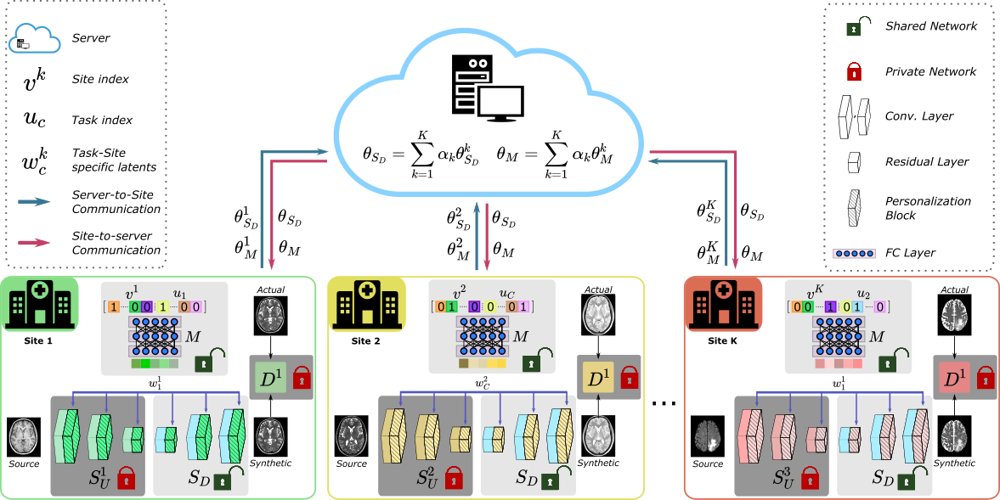
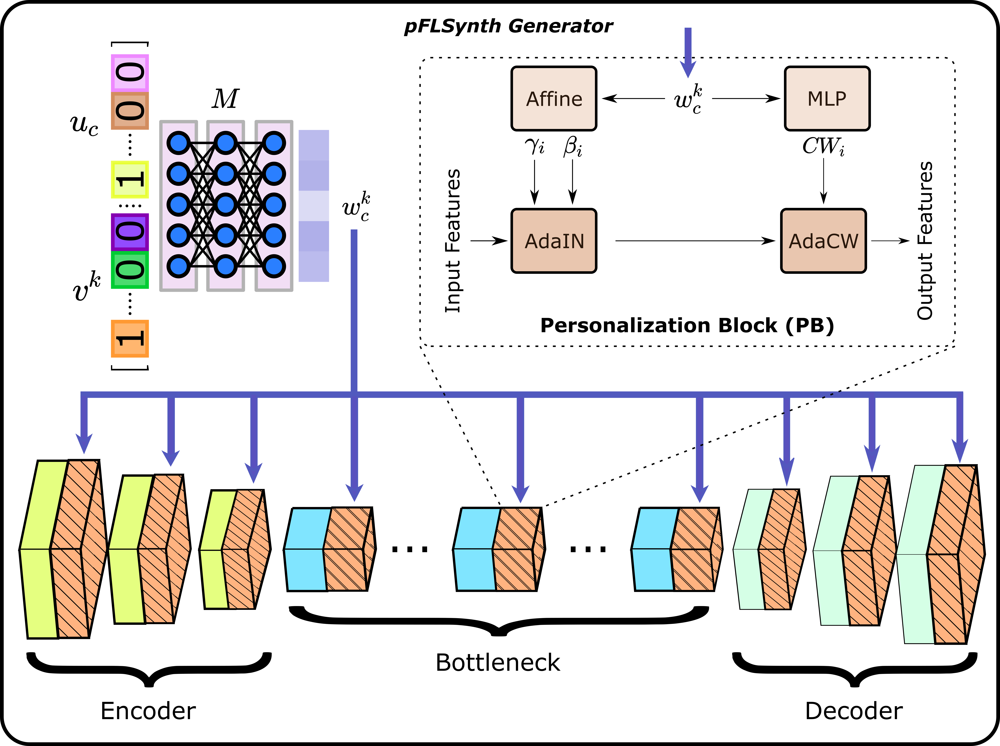
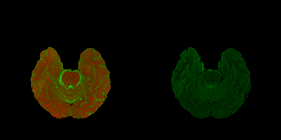

# pFLSynth
Official Pytorch Implementation of personalized Federated Learning of MRI Synthesis(pFLSynth) which is described in the [following](https://arxiv.org/abs/2207.06509) paper:

One Model to Unite Them All: Personalized Federated Learning of Multi-Contrast MRI Synthesis. Onat Dalmaz, Usama Mirza, Gökberk Elmas, Muzaffer Özbey, Salman UH Dar, Emir Ceyani, Salman Avestimehr, Tolga Çukur. ArXiV. 2022.




## Dependencies
```
python>=3.6.9
torch>=1.7.1
torchvision>=0.8.2
visdom
dominate
cuda=>11.2
```
## Installation
- Clone this repo:
```bash
git clone https://github.com/icon-lab/pFLSynth
cd pFLSynth
```

## Dataset
You should structure your aligned dataset in the following way:
```
/Datasets/BRATS/
  ├── T1_T2_FLAIR
```
```
/Datasets/BRATS/T1_T2_FLAIR/
  ├── train
  ├── val  
  ├── test   
```
```
/Datasets/BRATS/T1_T2_FLAIR/train/
  ├── 0.png
  ├── 1.png
  ├── 2.png
  ├── ...
```
For instance, "0.png" looks like this:



where in the left half T1- and T2-weighted images are in the Red and Green channels respectively, and in the right half FLAIR images are in the Green channel.

## Federated training of pFLSynth

<br />

```
python3 /auto/data2/odalmaz/FedSynth/3_heteregeneous/github/fedsynth/train_pflsynth.py --gpu_ids 0 --dataroot Datasets/IXI/T1_T2__PD/ --dataroot2 Datasets/BRATS/T1_T2__FLAIR/ --dataroot3 Datasets/MIDAS/T1_T2/ --dataroot4 Datasets/OASIS/T1_T2__FLAIR/ --name pFLSynth_experimental_setup_3 --model pflsynth_model --which_model_netG personalized_generator --which_direction AtoB --lambda_A 100 --dataset_mode aligned --norm batch --n_clients 4 --pool_size 0 --output_nc 1 --input_nc 2 --niter 75 --niter_decay 75 --save_epoch_freq 5 --checkpoints_dir checkpoints/
```

<br />
<br />

## Inference with personalized generator


```
python3 /auto/data2/odalmaz/FedSynth/3_heteregeneous/fedsynth/test.py --dataroot /auto/data2/odalmaz/Datasets/IXI/T1_T2__PD/ --name pFLSynth_experimental_setup_3 --gpu_ids 0 --dataset_mode aligned --model pflsynth_model --which_model_netG personalized_generator --which_direction AtoB --norm batch --output_nc 1 --input_nc 2 --checkpoints_dir checkpoints/ --phase test --how_many 10000 --serial_batches --results_dir results/ --dataset_name ixi --save_folder_name IXI --n_clients 4 --task_name t1_t2
```
You can specify the site and task during inference by modifying the dataroot to match the site and changing the task name. For example, if you would like to perform inference for FLAIR->T2 task in BRATS, specify --dataroot Datasets/BRATS/T1_T2__FLAIR/ and --task_name flair_t2

# Citation
You are encouraged to modify/distribute this code. However, please acknowledge this code and cite the paper appropriately.
```
@misc{dalmaz2022pflsynth
  doi = {10.48550/ARXIV.2207.06509},
  
  url = {https://arxiv.org/abs/2207.06509},
  
  author = {Dalmaz, Onat and Mirza, Usama and Elmas, Gökberk and Özbey, Muzaffer and Dar, Salman UH and Ceyani, Emir and Avestimehr, Salman and Çukur, Tolga},
  
  keywords = {Image and Video Processing (eess.IV), Computer Vision and Pattern Recognition (cs.CV), Machine Learning (cs.LG), FOS: Electrical engineering, electronic engineering, information engineering, FOS: Electrical engineering, electronic engineering, information engineering, FOS: Computer and information sciences, FOS: Computer and information sciences},
  
  title = {One Model to Unite Them All: Personalized Federated Learning of Multi-Contrast MRI Synthesis},
  
  publisher = {arXiv},
  
  year = {2022},
  
  copyright = {arXiv.org perpetual, non-exclusive license}
}

```
For any questions, comments and contributions, please contact Onat Dalmaz (onat[at]ee.bilkent.edu.tr) <br />

(c) ICON Lab 2022

## Acknowledgments
This code uses libraries from [pGAN](https://github.com/icon-lab/pGAN-cGAN) repository.
