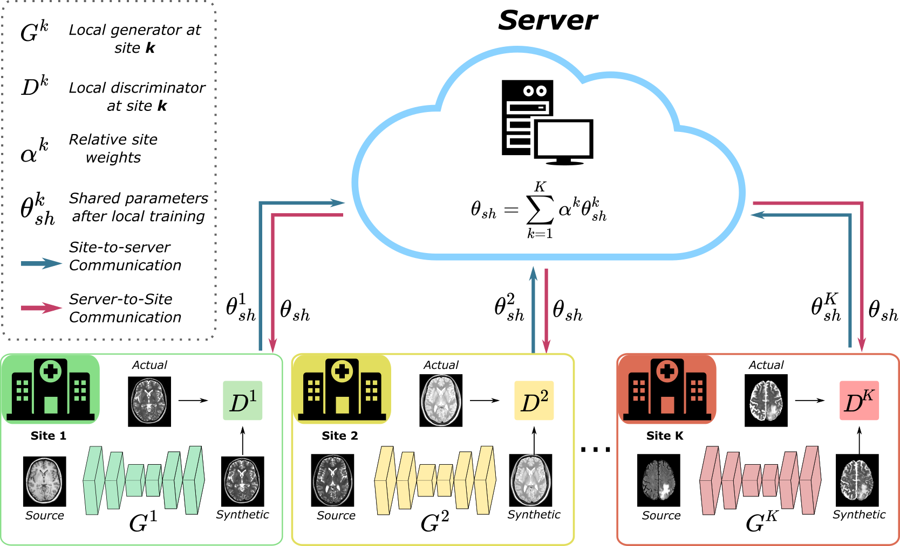
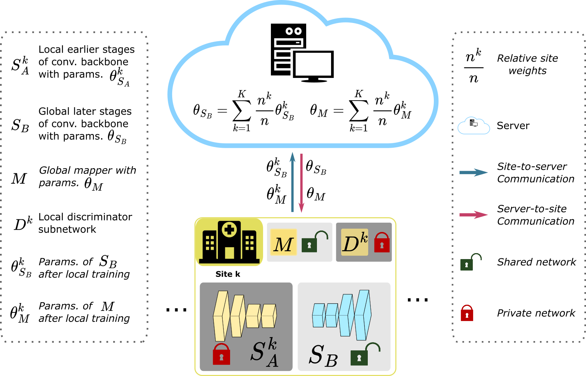

# pFLSynth
Official Pytorch Implementation of personalized Federated Learning of MRI Synthesis(pFLSynth) which is described in the [following](https://arxiv.org/abs/2207.06509) paper:

One Model to Unite Them All: Personalized Federated Learning of Multi-Contrast MRI Synthesis. Onat Dalmaz, Usama Mirza, Gökberk Elmas, Muzaffer Özbey, Salman UH Dar, Emir Ceyani, Salman Avestimehr, Tolga Çukur. ArXiV. 2022.





## Dependencies
```
python>=3.6.9
torch>=1.7.1
torchvision>=0.8.2
visdom
dominate
cuda=>11.2
```
## Installation
- Clone this repo:
```bash
git clone https://github.com/icon-lab/pFLSynth
cd pFLSynth
```

# Data Preprocessing

This section details the steps required to preprocess the imaging data before it can be used for analysis.

## Registration

In this step, different MRI sequences are aligned to a common space. The `register_sequences.py` script performs this task.

### Prerequisites

- FSL (FMRIB Software Library) must be installed on your system. You can download it from [FSL's official website](https://fsl.fmrib.ox.ac.uk/fsl/fslwiki).
- Python 3.x must be installed on your system.

### Usage

To use the registration script, you need to set up the input and output paths according to the downloaded dataset's structure. Open the `register_sequences.py` script in your favorite text editor and follow the `# TODO` comments to customize the paths and sequence names.

### Demo

Here is a demo of how to configure and run the `register_sequences.py` script.

1. Set the dataset root path where your MRI sequences are located:

    ```python
    # TODO: Replace with the path to the dataset's root directory
    dataset_root_path = "/path/to/dataset/root/"
    ```

2. Set the output path where the registered volumes will be saved:

    ```python
    # TODO: Replace with the path to the output directory for the registered volumes
    output_root_path = "/path/to/output/root/"
    ```

3. Customize the sequence names based on your dataset:

    ```python
    # TODO: Customize the MRI sequence names as per your dataset
    sequences = {
        'T1': 'T1w',  # Example: 'T1w' or 'T1_weighted'
        'T2': 'T2w',  # Example: 'T2w' or 'T2_weighted'
        'T2_FLAIR': 'FLAIR',  # Example: 'FLAIR' or 'PD' or 'T2_FLAIR'
        # Add or remove sequences as needed
    }
    ```

4. Run the script:

    ```bash
    python preprocess/register_sequences.py
    ```

The script will process each subject sequentially, registering the specified sequences to the T1-weighted images and saving the results in the output directory.

## Converting NIfTI to PNG

After completing the registration process, the next step in the pipeline is to convert the NIfTI files into PNG format. This conversion process takes each slice of the 3D MRI data and saves it as a 2D cross-section. The `process_nii_to_png.py` script automates this task.

### Usage

To use this script, you need to specify the input directory (where the NIfTI files are stored) and the output directory (where the PNG files will be saved).

1. Set the input directory in the script:

    ```python
    # TODO: Set your input directory containing NIfTI files
    input_directory = "/path/to/input/directory"
    ```

2. Set the output directory for the PNG files:

    ```python
    # TODO: Set your output directory for PNG files
    output_directory = "/path/to/output/directory"
    ```

3. Run the script:

    ```bash
    python preprocess/process_nii_to_png.py
    ```

This will process each NIfTI file, converting it into a series of 2D PNG images, each representing a slice from the 3D MRI data. The script organizes these PNG images into folders corresponding to their original NIfTI file names.

### Note

- It is advisable to have a backup of the original NIfTI files before running this script, as it involves reading and processing significant amounts of data.
- Ensure that the input and output directories are set correctly to avoid any unintended data loss.

## Combining Contrast Images into a Single Image

Following the preprocessing steps, we combine the PNG images of individual contrasts (T1, T2, FLAIR) into a single composite image where each contrast is represented in a separate color channel.

### Usage

To perform the combination of contrast images, run the `combine_contrasts.py` script, which takes the T1, T2, and FLAIR images and combines them into a single RGB image with transparency. The resulting images are saved to the specified output directory.

1. Set the input directory where individual contrast PNG images are located:

    ```python
    # TODO: Set the path where the PNG images are stored
    input_directory = "/auto/data2/umirza/OASIS_png/"
    ```

2. Set the output directory where the combined images will be saved:

    ```python
    # TODO: Set the path where the combined images will be saved
    output_directory = "/auto/data2/umirza/OASIS_full/"
    ```

3. Run the script:

    ```bash
    python preprocess/combine_contrasts.py
    ```

Each saved image will have T1, T2, and FLAIR contrasts combined, facilitating the visualization of differences between contrasts in the same slice.

### Note

- Ensure that each contrast directory within the input directory contains the same number of corresponding slices.
- The script will create the output directory if it does not exist, and it will overwrite existing files with the same name without warning.


# Training and Testing Models


## Federated training of pFLSynth
To initiate the federated training of the pFLSynth model, use the provided shell script. This script encapsulates all the necessary parameters and configurations required for the training process. 

To start training, simply execute:
<br />

```bash
bash train_pflsynth.sh
```

<br />
<br />

Ensure that train_pflsynth.sh is properly configured with the right paths and parameters specific to your dataset and training environment. 
## Inference


```bash
bash test.sh
```

## Training Competing Methods

This repository includes several scripts for training different competing methods, including centralized benchmarks, in our framework. These methods can be easily executed using the provided shell scripts.

## Usage

To train a specific competing method, run the corresponding shell script from the command line. Each script is named according to the method it trains. 
For example, to train the FedBN method:
```bash
bash train_fedbn.sh
```

Below are the available federated learning (FL) baselines and their respective script names:
FedBN: train_fedbn.sh
FedMRI: train_fedmri.sh
FedGAN: train_fedgan.sh
FedMed: train_fedmed.sh
FedMM: train_fedmm.sh
FedCycle: train_fedcycle.sh

Below are the available centralized benchmarks and their respective script names:
pFLSynth_cent: train_pflsynth_cent.sh
pGAN_cent: train_pgan_cent.sh
pix2pix_cent: train_pix2pix_cent.sh

# Performing Inference with Competing Methods

This repository includes a common script (`test.sh`) for performing inference with various competing methods, including pFLSynth. To run inference with a specific method, you'll need to modify the script slightly for each method.

## Usage

The `test.sh` script is designed to be easily adaptable for different methods. To use it for a particular competing method, you will need to update certain arguments in the script:

1. **Model Name (`--name`)**: Specify the name of the experiment or model. This should match the name used during training.
2. **Model Type (`--model`)**: Indicate the model type, which corresponds to the competing method being tested.
3. **Generator Model (`--which_model_netG`)**: Choose the appropriate generator model for the method.
4. **Task Name (`--task_name`)** (optional): If applicable, specify the task name.

### Example for FedBN

For instance, to test with the "Method XYZ," you would modify the script as follows:

```bash
python3 test.py \
--dataroot /auto/data2/odalmaz/Datasets/IXI/T1_T2__PD/ \
--name FedBN_variable_setup_exp \
--gpu_ids 0 \
--dataset_mode aligned \
--model federated_synthesis \
--which_model_netG resnet_generator \
--which_direction AtoB \
--norm batch \
--output_nc 1 \
--input_nc 2 \
--checkpoints_dir checkpoints/ \
--phase test \
--how_many 10000 \
--serial_batches \
--results_dir results/ \
--dataset_name ixi \
--save_folder_name IXI \
--n_clients 4 \
--task_name t1_t2
```

# Evaluation

After conducting inference using the `test.sh` script, the generated images are saved in specific directories. To evaluate these results, follow the steps below to locate and analyze the generated images.

The output images from inference are stored in directories with the following naming convention:

```bash
/results/<name>/test_<which_epoch>_<dataset>_<task_name>/images/
```

- `<name>`: Represents the experiment name or setup.
- `<which_epoch>`: Indicates the specific epoch of the test, typically 'latest' or a specific epoch number.
- `<dataset>`: Which dataset
- `<task_name>`: Describes the task for which inference was run (e.g., 't1_t2').

## PSNR/SSIM Calculation

### Overview
This script calculates the Peak Signal-to-Noise Ratio (PSNR) and Structural Similarity Index (SSIM) between pairs of real and synthesized images.

### Usage
To use the PSNR/SSIM calculation script, you need to specify the directory containing the real and fake images generated by your model. The script assumes the presence of corresponding real images in the same directory.

Command:
```bash
python evaluation/psnr_ssim.py --fake_dir <path_to_results_directory> [--normalize <0 or 1>]
```
## FID Calculation

### Overview
The Frechet Inception Distance (FID) is a widely used metric to assess the quality of images generated by GANs. It compares the distribution of generated images to that of real images.

This script calculates the Frechet Inception Distance (FID) between datasets of real and synthesized images.

### Usage
To calculate FID, you need to specify the directory containing the real and fake images generated by your model. The script assumes the presence of corresponding real images in the same directory.

Command:
```bash
python evaluation/fid.py --p1 <path_to_results_directory> [--gpu_ids <gpu_id>] [--multiprocessing] [--batch-size <batch_size>]
```


# Citation
Preliminary versions of pFLSynth are presented in [MICCAI DeCaF](https://link.springer.com/chapter/10.1007/978-3-031-18523-6_8),  [NeurIPS Medical Imaging Meets](https://www.cse.cuhk.edu.hk/~qdou/public/medneurips2022/103.pdf) (Oral), and IEEE ISBI 2023.
You are encouraged to modify/distribute this code. However, please acknowledge this code and cite the paper appropriately.
```
@misc{dalmaz2022pflsynth
  doi = {10.48550/ARXIV.2207.06509},
  
  url = {https://arxiv.org/abs/2207.06509},
  
  author = {Dalmaz, Onat and Mirza, Usama and Elmas, Gökberk and Özbey, Muzaffer and Dar, Salman UH and Ceyani, Emir and Avestimehr, Salman and Çukur, Tolga},
  
  keywords = {Image and Video Processing (eess.IV), Computer Vision and Pattern Recognition (cs.CV), Machine Learning (cs.LG), FOS: Electrical engineering, electronic engineering, information engineering, FOS: Electrical engineering, electronic engineering, information engineering, FOS: Computer and information sciences, FOS: Computer and information sciences},
  
  title = {One Model to Unite Them All: Personalized Federated Learning of Multi-Contrast MRI Synthesis},
  
  publisher = {arXiv},
  
  year = {2022},
  
  copyright = {arXiv.org perpetual, non-exclusive license}
}

```
For any questions, comments and contributions, please contact Onat Dalmaz (onat[at]ee.bilkent.edu.tr) <br />

(c) ICON Lab 2022

## Acknowledgments
This code uses libraries from [pGAN](https://github.com/icon-lab/pGAN-cGAN) repository.
